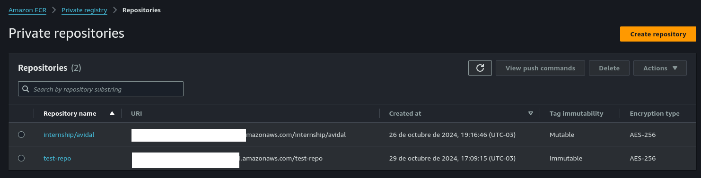

<!-- BEGIN_TF_DOCS -->
# Description

This Terraform module manages the creation and configuration of AWS Elastic Container Registry (ECR) repositories. It provides a flexible setup for managing private or public container repositories, including features such as tag mutability, image scanning, and encryption. This module is designed to be reusable and can accommodate multiple repositories with custom configurations for each.

## Requirements

| Name | Version |
|------|---------|
| <a name="provider_aws"></a> [aws](#provider\_aws) | >= 5.61 |
| <a name="provider_terraform"></a> [terraform](#provider\_aws) | >= 1.9 |

## Providers

| Name | Version |
|------|---------|
| <a name="provider_aws"></a> [aws](#provider\_aws) | 5.72.0 |

## Modules

| Name | Source | Version |
|------|--------|---------|
| <a name="module_ecr"></a> [ecr](#module\_ecr) | terraform-aws-modules/ecr/aws | 2.3.0 |

## Resources

| Name | Type |
|------|------|
| [aws_caller_identity.current](https://registry.terraform.io/providers/hashicorp/aws/latest/docs/data-sources/caller_identity) | data source |

## Usage

By default, the module grants repository read/write access to the AWS user or role running the Terraform code. You can override this by specifying ARNs in the repository_read_write_access_arns variable.

```hcl
data "aws_caller_identity" "current" {}
```

```hcl
module "ecr" {
  source  = "terraform-aws-modules/ecr/aws"
  
  version = var.module_version
  for_each = toset(var.repository_names)

  create_lifecycle_policy = false
  repository_image_tag_mutability = var.repository_image_tag_mutability

  repository_name = each.value  
  repository_read_write_access_arns = length(var.repository_read_write_access_arns) > 0 ? var.repository_read_write_access_arns : [data.aws_caller_identity.current.arn]
}
```
## Test

```hcl
data "aws_caller_identity" "current" {}

module "ecr" {
  source = "./ecr"  # Path to the module directory

  version = "2.3.0"
  repository_names = ["test-repo"]
  repository_image_tag_mutability = "IMMUTABLE"
  repository_read_write_access_arns = [
    "arn:aws:iam::123456789123:group/Interns",
    data.aws_caller_identity.current.arn
  ]
}
```



## Inputs

| Name | Description | Type | Default | Required |
|------|-------------|------|---------|:--------:|
| <a name="input_attach_repository_policy"></a> [attach\_repository\_policy](#input\_attach\_repository\_policy) | Determines whether a repository policy will be attached to the repository | `bool` | `true` | no |
| <a name="input_create"></a> [create](#input\_create) | Determines whether resources will be created (affects all resources) | `bool` | `true` | no |
| <a name="input_create_lifecycle_policy"></a> [create\_lifecycle\_policy](#input\_create\_lifecycle\_policy) | Determines whether a lifecycle policy will be created | `bool` | `true` | no |
| <a name="input_create_registry_policy"></a> [create\_registry\_policy](#input\_create\_registry\_policy) | Determines whether a registry policy will be created | `bool` | `false` | no |
| <a name="input_create_registry_replication_configuration"></a> [create\_registry\_replication\_configuration](#input\_create\_registry\_replication\_configuration) | Determines whether a registry replication configuration will be created | `bool` | `false` | no |
| <a name="input_create_repository"></a> [create\_repository](#input\_create\_repository) | Determines whether a repository will be created | `bool` | `true` | no |
| <a name="input_create_repository_policy"></a> [create\_repository\_policy](#input\_create\_repository\_policy) | Determines whether a repository policy will be created | `bool` | `true` | no |
| <a name="input_manage_registry_scanning_configuration"></a> [manage\_registry\_scanning\_configuration](#input\_manage\_registry\_scanning\_configuration) | Determines whether the registry scanning configuration will be managed | `bool` | `false` | no |
| <a name="input_module_version"></a> [module\_version](#input\_module\_version) | Version of the ECR module to use | `string` | `"2.3.0"` | no |
| <a name="input_public_repository_catalog_data"></a> [public\_repository\_catalog\_data](#input\_public\_repository\_catalog\_data) | Catalog data configuration for the repository | `any` | `{}` | no |
| <a name="input_registry_policy"></a> [registry\_policy](#input\_registry\_policy) | The policy document. This is a JSON formatted string | `string` | `null` | no |
| <a name="input_registry_pull_through_cache_rules"></a> [registry\_pull\_through\_cache\_rules](#input\_registry\_pull\_through\_cache\_rules) | List of pull through cache rules to create | `map(map(string))` | `{}` | no |
| <a name="input_registry_replication_rules"></a> [registry\_replication\_rules](#input\_registry\_replication\_rules) | The replication rules for a replication configuration. A maximum of 10 are allowed | `any` | `[]` | no |
| <a name="input_registry_scan_rules"></a> [registry\_scan\_rules](#input\_registry\_scan\_rules) | One or multiple blocks specifying scanning rules to determine which repository filters are used and at what frequency scanning will occur | `any` | `[]` | no |
| <a name="input_registry_scan_type"></a> [registry\_scan\_type](#input\_registry\_scan\_type) | the scanning type to set for the registry. Can be either `ENHANCED` or `BASIC` | `string` | `"ENHANCED"` | no |
| <a name="input_repository_encryption_type"></a> [repository\_encryption\_type](#input\_repository\_encryption\_type) | The encryption type for the repository. Must be one of: `KMS` or `AES256`. Defaults to `AES256` | `string` | `null` | no |
| <a name="input_repository_force_delete"></a> [repository\_force\_delete](#input\_repository\_force\_delete) | If `true`, will delete the repository even if it contains images. Defaults to `false` | `bool` | `null` | no |
| <a name="input_repository_image_scan_on_push"></a> [repository\_image\_scan\_on\_push](#input\_repository\_image\_scan\_on\_push) | Indicates whether images are scanned after being pushed to the repository (`true`) or not scanned (`false`) | `bool` | `true` | no |
| <a name="input_repository_image_tag_mutability"></a> [repository\_image\_tag\_mutability](#input\_repository\_image\_tag\_mutability) | The tag mutability setting for the repository. Must be one of: `MUTABLE` or `IMMUTABLE`. Defaults to `IMMUTABLE` | `string` | `"IMMUTABLE"` | no |
| <a name="input_repository_kms_key"></a> [repository\_kms\_key](#input\_repository\_kms\_key) | The ARN of the KMS key to use when encryption\_type is `KMS`. If not specified, uses the default AWS managed key for ECR | `string` | `null` | no |
| <a name="input_repository_lambda_read_access_arns"></a> [repository\_lambda\_read\_access\_arns](#input\_repository\_lambda\_read\_access\_arns) | The ARNs of the Lambda service roles that have read access to the repository | `list(string)` | `[]` | no |
| <a name="input_repository_lifecycle_policy"></a> [repository\_lifecycle\_policy](#input\_repository\_lifecycle\_policy) | The policy document. This is a JSON formatted string. See more details about [Policy Parameters](http://docs.aws.amazon.com/AmazonECR/latest/userguide/LifecyclePolicies.html#lifecycle_policy_parameters) in the official AWS docs | `string` | `""` | no |
| <a name="input_repository_name"></a> [repository\_name](#input\_repository\_name) | The name of the repository | `string` | `""` | no |
| <a name="input_repository_names"></a> [repository\_names](#input\_repository\_names) | n/a | `list(string)` | n/a | yes |
| <a name="input_repository_policy"></a> [repository\_policy](#input\_repository\_policy) | The JSON policy to apply to the repository. If not specified, uses the default policy | `string` | `null` | no |
| <a name="input_repository_read_access_arns"></a> [repository\_read\_access\_arns](#input\_repository\_read\_access\_arns) | The ARNs of the IAM users/roles that have read access to the repository | `list(string)` | `[]` | no |
| <a name="input_repository_read_write_access_arns"></a> [repository\_read\_write\_access\_arns](#input\_repository\_read\_write\_access\_arns) | The ARNs of the IAM users/roles that have read/write access to the repository | `list(string)` | `[]` | no |
| <a name="input_repository_type"></a> [repository\_type](#input\_repository\_type) | The type of repository to create. Either `public` or `private` | `string` | `"private"` | no |
| <a name="input_tags"></a> [tags](#input\_tags) | A map of tags to add to all resources | `map(string)` | `{}` | no |

## Outputs

| Name | Description |
|------|-------------|
| <a name="output_ecr_module_version"></a> [ecr\_module\_version](#output\_ecr\_module\_version) | The version of the ECR module in use |
| <a name="output_repository_arns"></a> [repository\_arns](#output\_repository\_arns) | Full ARN of the repository |
| <a name="output_repository_registry_ids"></a> [repository\_registry\_ids](#output\_repository\_registry\_ids) | The registry ID where the repository was created |
| <a name="output_repository_urls"></a> [repository\_urls](#output\_repository\_urls) | Full ARN of the repository |
<!-- END_TF_DOCS -->